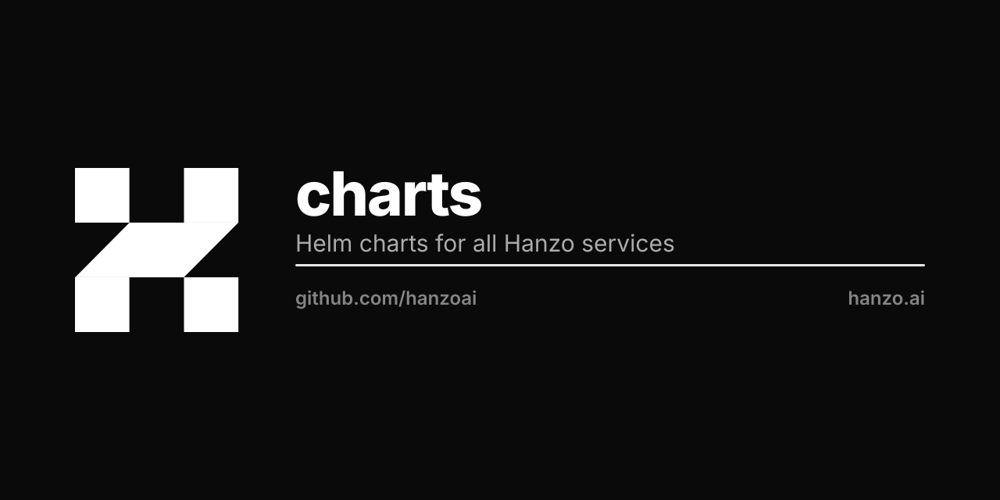

<p align="center"></p>

# Hanzo Helm Charts

Official Helm charts for all Hanzo services and infrastructure.

## Charts

### Core Services
| Chart | Description | Upstream |
|-------|-------------|----------|
| `hanzo-iam` | Identity and Access Management | - |
| `hanzo-kms` | Key Management Service | - |
| `hanzo-gateway` | API Gateway (KrakenD-based) | [krakend/krakend-ce](https://github.com/krakend/krakend-ce) |

### AI Services
| Chart | Description | Upstream |
|-------|-------------|----------|
| `hanzo-cloud` | Multi-tenant AI/MCP platform | - |
| `hanzo-agents` | AI Agent Orchestration | - |
| `hanzo-llm` | LLM Serving (vLLM-based) | [vllm-project/vllm](https://github.com/vllm-project/vllm) |

### Platform Services
| Chart | Description | Upstream |
|-------|-------------|----------|
| `hanzo-console` | Admin Console UI | - |
| `hanzo-gitops` | K8s CI/CD (Tekton-based) | [cloud-agnost/agnost-gitops](https://github.com/cloud-agnost/agnost-gitops) |
| `hanzo-platform` | Local Dev Platform | [dokploy/dokploy](https://github.com/dokploy/dokploy) |

### Business Services
| Chart | Description | Upstream |
|-------|-------------|----------|
| `hanzo-commerce` | Multi-tenant Commerce | - |
| `hanzo-analytics` | Analytics Service | - |

### Infrastructure Services
| Chart | Description | Upstream |
|-------|-------------|----------|
| `hanzo-storage` | S3-compatible Object Storage | - |
| `hanzo-bootnode` | Blockchain Infrastructure | - |
| `hanzo-mpc` | Threshold Signatures (TSS) | - |
| `hanzo-datastore` | Real-time Analytics Database | - |

## Related Repos

| Repo | Description |
|------|-------------|
| [hanzoai/stack](https://github.com/hanzoai/stack) | Full local stack (docker-compose) |

## Installation

### Add the Hanzo Helm repository

```bash
helm repo add hanzo https://charts.hanzo.ai
helm repo update
```

### Install individual charts

```bash
# Install IAM
helm install hanzo-iam hanzo/iam -n hanzo --create-namespace

# Install Gateway (KrakenD)
helm install hanzo-gateway hanzo/gateway -n hanzo

# Install Cloud (AI/MCP platform)
helm install hanzo-cloud hanzo/cloud -n hanzo
```

### Install full stack

```bash
helm install hanzo hanzo/stack -n hanzo --create-namespace \
  --set global.domain=yourdomain.com \
  --set iam.enabled=true \
  --set gateway.enabled=true \
  --set cloud.enabled=true \
  --set console.enabled=true
```

## Architecture

```
                    ┌─────────────────┐
                    │  hanzo-gateway  │ (KrakenD)
                    │   LoadBalancer  │
                    └────────┬────────┘
                             │
         ┌───────────────────┼───────────────────┐
         │                   │                   │
    ┌────▼────┐        ┌─────▼─────┐       ┌─────▼─────┐
    │hanzo-iam│        │hanzo-cloud│       │hanzo-api  │
    │ (Auth)  │        │ (AI/MCP)  │       │ (Services)│
    └────┬────┘        └─────┬─────┘       └─────┬─────┘
         │                   │                   │
         └───────────────────┼───────────────────┘
                             │
                    ┌────────▼────────┐
                    │ hanzo-datastore │ (Shared)
                    │ PostgreSQL/Redis│
                    └─────────────────┘
```

## Observability

Hanzo uses:
- **VictoriaMetrics** for metrics (not Prometheus)
- **Grafana** for dashboards
- **Hanzo Datastore** for logs and analytics (shared across all services)

## Configuration

### Common Global Values

```yaml
global:
  domain: hanzo.ai
  imageRegistry: ghcr.io/hanzoai
  storageClass: do-block-storage
  tls:
    enabled: true
    issuer: letsencrypt-prod
```

### Per-Chart Configuration

See individual chart `values.yaml` files for detailed configuration options.

## Upstream Tracking

Several charts are based on upstream projects:

| Hanzo Chart | Upstream | Tracking |
|-------------|----------|----------|
| `gateway` | KrakenD CE | Latest 2.x |
| `gitops` | Agnost GitOps | [hanzoai/gitops](https://github.com/hanzoai/gitops) |
| `platform` | Dokploy | Latest main |
| `llm` | vLLM | Latest stable |

## Development

### Prerequisites

- Kubernetes 1.25+
- Helm 3.12+

### Testing

```bash
# Lint all charts
helm lint charts/*

# Template a chart
helm template test charts/iam --debug

# Install with dry-run
helm install test charts/iam --dry-run --debug
```

### Contributing

1. Fork the repository
2. Create a feature branch
3. Make your changes
4. Run `helm lint` and `helm template`
5. Submit a pull request

## License

Apache 2.0

